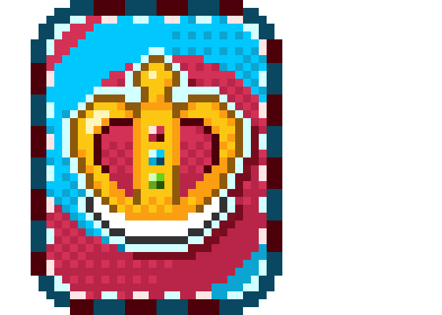
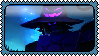
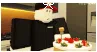
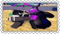
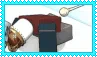
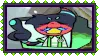
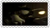
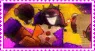

profile formatting may be messed up on mobile!

  
about me

  hihi! im bloxxy!! bloxxycake. ^_^

  adhd && suspected depression ns self / yumeshipper - stranger things mainly
 
  pronounflux && genderflux, ask preffered before assuming

  i mainly use it/its and he/him pronouns + masc terms

  genderfluidboy + xenogenders, fictoromantic/sexual ONLY. i do not experience sexual attraction to real people

  implasexual, polarsexual + aceflux, adhd anger issues. 

  pony town trades open and free to anything!

  almost all socials are @bloxxycake

  special interest: roblox / args ; current interest: stranger things

  

  

  
stances/dni

  i have a standard dni. i will simply ignore you if i dont like you. follow your own dni and block me if you dont agree with/tolerate my stances below!

  stances:

  { do not cover me unless friends

  crowd discomfort

  discomforted by excessive booping unless friends

  yumeshipping

  selfshipping

  kys/kms jokes

  boundaries in general if you broke them }

  specifically these people dni, and dni if you harass ***anyone*** over ***anything***

  adults iwc and under 13 or 14 preferably do not friend

  also i block a lot of people, so for those who dont, id like to know if i were sitting on someone, or if someone was sitting on me ^^"

  

  
 

important

i am diagnosed with [adhd](https://adhdresources.carrd.co/). this affects my memory over little or big things. read the linked carrd and educate yourself before trying to get close. For me, It is explained simply in many websites such as the ones i'm going to link. for [1.](https://www.simplypsychology.org/adhd-relationships.html) for [2.](https://www.psychologytoday.com/us/blog/upward-spiral/202505/scattered-love-why-adhd-can-make-relationships-so-hard) for [3.](https://www.mayoclinic.org/diseases-conditions/adhd/symptoms-causes/syc-20350889) But basically in short, I will have very intense mood swings, like frustration or sadness, even outbursts. So i apologize if i hurt you or have left you because of thinking of myself as a burden. I tend to overthink alot most of the time, so i'm mostly on a 'dniu' or 'iwcu' in my name sometimes. If you do not want to deal with my misput behavior, You can unfriend me. I am still learning to be a better person because of my disorder. Thank you for reading.

 hihi hello dearest friends!!!! ♡⠀⠀ [@Bootleg-Employer](https://github.com/Bootleg-Employer),[@EternalSugarCookie](https://github.com/EternalSugarCookie),[@holoyuri-luvr](https://github.com/holoyuri-luvr),[@doppelmops](https://github.com/doppelmops),[@ShiorinSha3yu](https://github.com/ShiorinSha3yu),[@VannySTARtree](https://github.com/VannySTARtree),[@toejjam](https://github.com/toejjam).

 stamps yay!!!!!!!!!!!!!!!!

  
  

